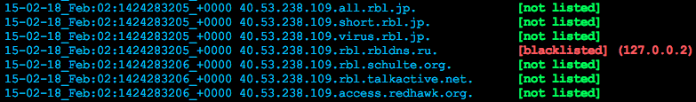

# blacklist-check-unix-linux-utility
Blacklist check UNIX/Linux utility. I was just a bit tired of web interfaces.

### Introduction

Check blacklisting for domains and IP addresses in shell.

Works on UNIX/Linux systems with Bash.

Blacklists grabbed from https://hetrixtools.com/blacklist-check. Previously used http://multirbl.valli.org/, but changed due to hetrixtools.com providing a list with more reliable responses. You can find both below or go to the url and copy/paste them.

### Installation

    git clone https://github.com/adionditsak/blacklist-check-unix-linux-utility.git
    cd blacklist-check-unix-linux-utility
    chmod +x ./bl
    mv ./bl /usr/bin

### Usage

    # Use with domains or IP addresses
    $ bl domain.tld
    $ bl 8.8.8.8 # IP
    
    # Pipe with other UNIX utils, eg. grep. Only blacklisted:
    $ bl domain.tld | grep "blacklisted"

### Sample output

    $ bl 8.8.8.8
    You entered an IP: 8.8.8.8
    8.8.8.8 name google-public-dns-a.google.com.
    15-02-17_Feb:02:1424185674_+0000 8.8.8.8.0spam.fusionzero.com.          [not listed]
    15-02-17_Feb:02:1424185674_+0000 8.8.8.8.0spam-killlist.fusionzero.com. [not listed]
    15-02-17_Feb:02:1424185674_+0000 8.8.8.8.rbl.abuse.ro.                  [not listed]
    15-02-17_Feb:02:1424185674_+0000 8.8.8.8.spam.dnsbl.anonmails.de.       [not listed]
    15-02-17_Feb:02:1424185674_+0000 8.8.8.8.dnsbl.anticaptcha.net.         [not listed]
    ...

### blacklists providers

#### multirbl.valli.org

    #### blacklists - grabbed from http://multirbl.valli.org/ ####
    blacklists="
    0spamurl.fusionzero.com
    uribl.zeustracker.abuse.ch
    uribl.abuse.ro
    bsb.empty.us
    bsb.spamlookup.net
    ex.dnsbl.org
    in.dnsbl.org
    bl.fmb.la
    communicado.fmb.la
    nsbl.fmb.la
    short.fmb.la
    black.junkemailfilter.com
    ubl.nszones.com
    uribl.pofon.foobar.hu
    abuse.rfc-clueless.org
    bogusmx.rfc-clueless.org
    dsn.rfc-clueless.org
    elitist.rfc-clueless.org
    fulldom.rfc-clueless.org
    postmaster.rfc-clueless.org
    whois.rfc-clueless.org
    mailsl.dnsbl.rjek.com
    urlsl.dnsbl.rjek.com
    rhsbl.rymsho.ru
    public.sarbl.org
    rhsbl.scientificspam.net
    nomail.rhsbl.sorbs.net
    badconf.rhsbl.sorbs.net
    rhsbl.sorbs.net
    fresh.spameatingmonkey.net
    fresh10.spameatingmonkey.net
    fresh15.spameatingmonkey.net
    uribl.spameatingmonkey.net
    urired.spameatingmonkey.net
    dbl.spamhaus.org
    dnsbl.spfbl.net
    dbl.suomispam.net
    multi.surbl.org
    dob.sibl.support-intelligence.net
    black.uribl.com
    grey.uribl.com
    multi.uribl.com
    red.uribl.com
    uri.blacklist.woody.ch
    rhsbl.zapbl.net
    sa.fmb.la
    hostkarma.junkemailfilter.com
    nobl.junkemailfilter.com
    reputation-domain.rbl.scrolloutf1.com
    reputation-ns.rbl.scrolloutf1.com
    dwl.dnswl.org
    iddb.isipp.com
    _vouch.dwl.spamhaus.org
    dnswl.spfbl.net
    white.uribl.com
    "
    
#### hetrixtools.com/blacklist-check

    #### blacklists - grabbed from https://hetrixtools.com/blacklist-check ####
    blacklists="
    0spam.fusionzero.com
    access.redhawk.org
    all.s5h.net
    all.spamrats.com
    aspews.ext.sorbs.net
    babl.rbl.webiron.net
    backscatter.spameatingmonkey.net
    b.barracudacentral.org
    bb.barracudacentral.org
    black.junkemailfilter.com
    bl.blocklist.de
    bl.drmx.org
    bl.konstant.no
    bl.mailspike.net
    bl.nosolicitado.org
    bl.nszones.com
    block.dnsbl.sorbs.net
    bl.rbl.scrolloutf1.com
    bl.scientificspam.net
    bl.score.senderscore.com
    bl.spamcop.net
    bl.spameatingmonkey.net
    bl.suomispam.net
    bsb.empty.us
    cart00ney.surriel.com
    cbl.abuseat.org
    cbl.anti-spam.org.cn
    cblless.anti-spam.org.cn
    cblplus.anti-spam.org.cn
    cdl.anti-spam.org.cn
    combined.rbl.msrbl.net
    db.wpbl.info
    dnsbl-1.uceprotect.net
    dnsbl-2.uceprotect.net
    dnsbl-3.uceprotect.net
    dnsbl.cobion.com
    dnsbl.dronebl.org
    dnsbl.justspam.org
    dnsbl.kempt.net
    dnsbl.net.ua
    dnsbl.rv-soft.info
    dnsbl.rymsho.ru
    dnsbl.sorbs.net
    dnsbl.spfbl.net
    dnsbl.tornevall.org
    dnsbl.zapbl.net
    dnsrbl.org
    dnsrbl.swinog.ch
    dul.dnsbl.sorbs.net
    dyna.spamrats.com
    dyn.nszones.com
    escalations.dnsbl.sorbs.net
    fnrbl.fast.net
    hostkarma.junkemailfilter.com
    http.dnsbl.sorbs.net
    images.rbl.msrbl.net
    invaluement
    ips.backscatterer.org
    ix.dnsbl.manitu.net
    l1.bbfh.ext.sorbs.net
    l2.bbfh.ext.sorbs.net
    l4.bbfh.ext.sorbs.net
    list.bbfh.org
    mail-abuse.blacklist.jippg.org
    misc.dnsbl.sorbs.net
    multi.surbl.org
    netscan.rbl.blockedservers.com
    new.spam.dnsbl.sorbs.net
    noptr.spamrats.com
    old.spam.dnsbl.sorbs.net
    pbl.spamhaus.org
    phishing.rbl.msrbl.net
    pofon.foobar.hu
    problems.dnsbl.sorbs.net
    proxies.dnsbl.sorbs.net
    psbl.surriel.com
    rbl2.triumf.ca
    rbl.abuse.ro
    rbl.blockedservers.com
    rbl.dns-servicios.com
    rbl.efnet.org
    rbl.efnetrbl.org
    rbl.interserver.net
    rbl.megarbl.net
    rbl.realtimeblacklist.com
    recent.spam.dnsbl.sorbs.net
    relays.dnsbl.sorbs.net
    rep.mailspike.net
    safe.dnsbl.sorbs.net
    sbl.spamhaus.org
    smtp.dnsbl.sorbs.net
    socks.dnsbl.sorbs.net
    spam.dnsbl.anonmails.de
    spam.dnsbl.sorbs.net
    spamlist.or.kr
    spam.pedantic.org
    spam.rbl.blockedservers.com
    spamrbl.imp.ch
    spam.rbl.msrbl.net
    spamsources.fabel.dk
    spam.spamrats.com
    srn.surgate.net
    stabl.rbl.webiron.net
    st.technovision.dk
    talosintelligence.com
    torexit.dan.me.uk
    truncate.gbudb.net
    ubl.unsubscore.com
    virus.rbl.msrbl.net
    web.dnsbl.sorbs.net
    web.rbl.msrbl.net
    xbl.spamhaus.org
    zen.spamhaus.org
    z.mailspike.net
    zombie.dnsbl.sorbs.net
    "
